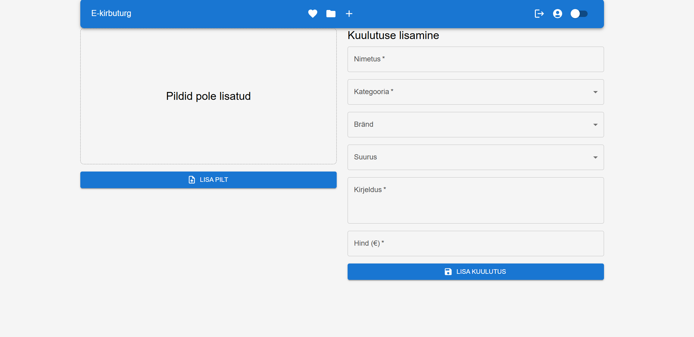

# Sales Platform as a Web Application for Supporting the Secondary Clothing Market
[Link on the thesis document (in estonian)](https://drive.google.com/file/d/1mZBWsVfg_8mGckYtLpe120GCaM-U29Ck/view?usp=sharing)

## Project description

This project was developed as part of my thesis work. It is a web application designed to support the secondary clothing market by providing a platform where registered users can sell and purchase clothing items. The platform offers essential features such as managing users' items, filtering and searching on the shopping page, and maintaining a list of favorite items. Initially, the project is localized for the Estonian market.

### Shopping Page

### Shopping Page Dark theme

### Item Creation Page

### Item Details

